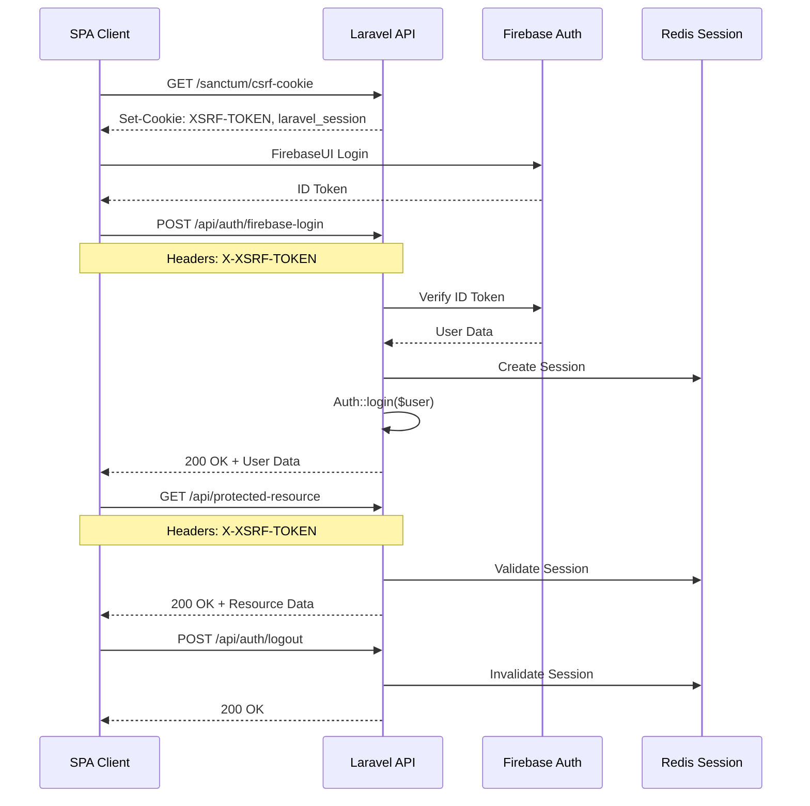

# 인증 API 엔드포인트 문서 ✅ READ

작성일: 2025-10-01
작성자: Documentation Reviewer (Claude Agent)
상태: Phase 2 완료 - API v1

## 개요

본 문서는 Firebase Authentication과 Laravel Sanctum을 통합한 인증 시스템의 API 엔드포인트를 정의합니다.

### 기본 정보

- **Base URL**: 환경별 API 도메인
  - 개발: `https://admin.dev.olulo.com.mx/api`
  - 스테이징: `https://admin.demo.olulo.com.mx/api`
  - 프로덕션: `https://admin.olulo.com.mx/api`
- **인증 방식**: Sanctum SPA Session (Cookie-based)
- **Content-Type**: `application/json`
- **인코딩**: UTF-8

### 공통 헤더

모든 API 요청에 다음 헤더를 포함해야 합니다:

- `Accept: application/json`
- `Content-Type: application/json`
- `Accept-Language: ko|en|es-MX` (선택)

보호된 엔드포인트 요청 시 추가 헤더:

- `X-XSRF-TOKEN: {csrf_token}` (CSRF 토큰)

## 인증 플로우

### 1. SPA 클라이언트 초기화 시퀀스

```
1. GET /sanctum/csrf-cookie (CSRF 토큰 획득)
2. Firebase에서 로그인하여 ID Token 획득
3. POST /api/auth/firebase-login (Laravel 세션 생성)
4. 이후 모든 요청에 세션 쿠키 + X-XSRF-TOKEN 헤더 포함
```

### 2. Mermaid 시퀀스 다이어그램



## 엔드포인트 목록

### 1. CSRF 토큰 획득

CSRF 토큰을 쿠키로 발급받는 엔드포인트입니다. SPA 클라이언트는 첫 API 요청 전에 이 엔드포인트를 호출해야 합니다.

#### 요청

```http
GET /sanctum/csrf-cookie
Host: admin.dev.olulo.com.mx
Accept: application/json
```

#### 응답

**성공 (204 No Content)**

```
Set-Cookie: XSRF-TOKEN={token}; Path=/; Domain=.dev.olulo.com.mx; Secure; HttpOnly
Set-Cookie: laravel_session={session_id}; Path=/; Domain=.dev.olulo.com.mx; Secure; HttpOnly
```

#### 상태 코드

- `204`: 성공 (쿠키 발급 완료)

#### 사용 예시 (JavaScript)

```javascript
// Axios 사용
await axios.get('/sanctum/csrf-cookie', {
  withCredentials: true
});

// Fetch API 사용
await fetch('https://admin.dev.olulo.com.mx/sanctum/csrf-cookie', {
  method: 'GET',
  credentials: 'include',
  headers: {
    'Accept': 'application/json'
  }
});
```

#### 주의사항

- 반드시 `withCredentials: true` 또는 `credentials: 'include'` 옵션 사용
- 이 엔드포인트는 Laravel Sanctum이 자동으로 제공
- Rate Limiting: 10회/분 (권장)

---

### 2. Firebase 로그인 (API)

Firebase ID Token을 검증하고 Laravel 세션을 생성하는 엔드포인트입니다.

#### 요청

```http
POST /api/auth/firebase-login
Host: admin.dev.olulo.com.mx
Content-Type: application/json
Accept: application/json
X-XSRF-TOKEN: {csrf_token}

{
  "idToken": "eyJhbGciOiJSUzI1NiIsImtpZCI6..."
}
```

#### 요청 본문

| 필드 | 타입 | 필수 | 설명 |
|------|------|------|------|
| `idToken` | string | 예 | Firebase에서 발급받은 ID Token |

#### 응답

**성공 (200 OK)**

```json
{
  "success": true,
  "message": "로그인에 성공했습니다.",
  "user": {
    "id": 1,
    "name": "홍길동",
    "email": "hong@example.com",
    "avatar_url": "https://lh3.googleusercontent.com/...",
    "firebase_uid": "abc123def456",
    "phone_number": "+52 55 1234 5678"
  }
}
```

**실패 - 유효하지 않은 토큰 (422 Unprocessable Entity)**

```json
{
  "success": false,
  "message": "유효하지 않은 Firebase 토큰입니다.",
  "errors": {
    "idToken": [
      "유효하지 않은 Firebase 토큰입니다."
    ]
  }
}
```

**실패 - 서버 오류 (500 Internal Server Error)**

```json
{
  "success": false,
  "message": "로그인 처리 중 오류가 발생했습니다."
}
```

#### 상태 코드

- `200`: 성공 (로그인 완료)
- `422`: 유효성 검증 실패 (잘못된 ID Token)
- `500`: 서버 오류

#### 사용 예시 (JavaScript)

```javascript
// Firebase에서 ID Token 획득
const user = firebase.auth().currentUser;
const idToken = await user.getIdToken();

// Laravel API 호출
const response = await axios.post('/api/auth/firebase-login',
  { idToken },
  {
    withCredentials: true,
    headers: {
      'X-XSRF-TOKEN': getCsrfTokenFromCookie()
    }
  }
);

console.log('로그인 성공:', response.data.user);
```

#### 주의사항

- 반드시 `/sanctum/csrf-cookie` 호출 후 사용
- Firebase ID Token의 유효 기간은 1시간
- Rate Limiting: 5회/분 (권장)

---

### 3. 로그아웃

Laravel 세션을 종료하는 엔드포인트입니다.

#### 요청

```http
POST /api/auth/logout
Host: admin.dev.olulo.com.mx
Content-Type: application/json
Accept: application/json
X-XSRF-TOKEN: {csrf_token}
```

#### 응답

**성공 (200 OK)**

```json
{
  "success": true,
  "message": "로그아웃되었습니다."
}
```

#### 상태 코드

- `200`: 성공 (로그아웃 완료)
- `401`: 인증되지 않은 요청

#### 사용 예시 (JavaScript)

```javascript
// Laravel 로그아웃
await axios.post('/api/auth/logout', {}, {
  withCredentials: true,
  headers: {
    'X-XSRF-TOKEN': getCsrfTokenFromCookie()
  }
});

// Firebase 로그아웃 (선택)
await firebase.auth().signOut();

// 로그인 페이지로 리다이렉트
window.location.href = '/auth/login';
```

#### 주의사항

- 로그아웃 후 세션 쿠키는 무효화됨
- Firebase 로그아웃은 클라이언트에서 별도로 처리 필요
- Rate Limiting: 5회/분 (권장)

---

### 4. 현재 사용자 정보 조회 (보호됨)

현재 로그인한 사용자의 정보를 조회하는 엔드포인트입니다.

#### 요청

```http
GET /api/auth/user
Host: admin.dev.olulo.com.mx
Accept: application/json
X-XSRF-TOKEN: {csrf_token}
```

#### 응답

**성공 (200 OK)**

```json
{
  "id": 1,
  "name": "홍길동",
  "email": "hong@example.com",
  "avatar_url": "https://lh3.googleusercontent.com/...",
  "firebase_uid": "abc123def456",
  "phone_number": "+52 55 1234 5678",
  "created_at": "2025-09-01T10:30:00.000000Z",
  "updated_at": "2025-10-01T15:45:00.000000Z"
}
```

**실패 - 인증되지 않음 (401 Unauthorized)**

```json
{
  "message": "Unauthenticated."
}
```

#### 상태 코드

- `200`: 성공 (사용자 정보 조회)
- `401`: 인증되지 않은 요청

#### 사용 예시 (JavaScript)

```javascript
const response = await axios.get('/api/auth/user', {
  withCredentials: true,
  headers: {
    'X-XSRF-TOKEN': getCsrfTokenFromCookie()
  }
});

console.log('현재 사용자:', response.data);
```

#### 주의사항

- 보호된 엔드포인트 (인증 필수)
- 로그인하지 않은 상태에서 호출 시 401 에러 반환

---

### 5. 언어 변경

애플리케이션 언어를 변경하는 엔드포인트입니다.

#### 요청

```http
POST /api/auth/locale/{locale}
Host: admin.dev.olulo.com.mx
Content-Type: application/json
Accept: application/json
X-XSRF-TOKEN: {csrf_token}
```

#### 경로 파라미터

| 파라미터 | 타입 | 설명 |
|----------|------|------|
| `locale` | string | 언어 코드 (`ko`, `en`, `es-MX`) |

#### 응답

**성공 (200 OK)**

```json
{
  "success": true,
  "message": "언어가 변경되었습니다.",
  "locale": "ko"
}
```

#### 상태 코드

- `200`: 성공 (언어 변경 완료)

#### 사용 예시 (JavaScript)

```javascript
// 한국어로 변경
await axios.post('/api/auth/locale/ko', {}, {
  withCredentials: true,
  headers: {
    'X-XSRF-TOKEN': getCsrfTokenFromCookie()
  }
});

// 스페인어(멕시코)로 변경
await axios.post('/api/auth/locale/es-MX', {}, {
  withCredentials: true,
  headers: {
    'X-XSRF-TOKEN': getCsrfTokenFromCookie()
  }
});
```

#### 지원 언어

- `ko`: 한국어
- `en`: 영어
- `es-MX`: 스페인어(멕시코)

---

## 에러 코드 및 메시지

### 공통 HTTP 상태 코드

| 코드 | 이름 | 설명 |
|------|------|------|
| `200` | OK | 요청 성공 (데이터 반환) |
| `204` | No Content | 요청 성공 (데이터 없음) |
| `400` | Bad Request | 잘못된 요청 형식 |
| `401` | Unauthorized | 인증되지 않음 |
| `403` | Forbidden | 권한 없음 |
| `404` | Not Found | 리소스를 찾을 수 없음 |
| `422` | Unprocessable Entity | 유효성 검증 실패 |
| `429` | Too Many Requests | Rate Limiting 초과 |
| `500` | Internal Server Error | 서버 오류 |
| `503` | Service Unavailable | 서비스 일시 중단 |

### 에러 응답 형식

```json
{
  "success": false,
  "message": "사용자 친화적인 에러 메시지",
  "errors": {
    "field_name": [
      "필드별 상세 에러 메시지"
    ]
  }
}
```

### 주요 에러 시나리오

#### 1. CSRF 토큰 누락 또는 불일치 (419)

```json
{
  "message": "CSRF token mismatch."
}
```

**해결 방법**: `/sanctum/csrf-cookie` 재호출 후 새로운 CSRF 토큰 사용

#### 2. 세션 만료 (401)

```json
{
  "message": "Unauthenticated."
}
```

**해결 방법**: 로그인 페이지로 리다이렉트

#### 3. Rate Limiting 초과 (429)

```json
{
  "message": "Too Many Attempts."
}
```

**해결 방법**: 일정 시간(1분) 후 재시도

#### 4. Firebase 토큰 만료 (422)

```json
{
  "success": false,
  "message": "유효하지 않은 Firebase 토큰입니다.",
  "errors": {
    "idToken": [
      "유효하지 않은 Firebase 토큰입니다."
    ]
  }
}
```

**해결 방법**: Firebase에서 새로운 ID Token 발급 후 재시도

---

## 프론트엔드 통합 가이드

### React/Next.js 예제

#### 1. Axios 인스턴스 생성

```javascript
// lib/axios.js
import axios from 'axios';

const api = axios.create({
  baseURL: process.env.NEXT_PUBLIC_API_URL,
  withCredentials: true,
  headers: {
    'Accept': 'application/json',
    'Content-Type': 'application/json',
  },
});

// CSRF 토큰 자동 추가
api.interceptors.request.use((config) => {
  const token = getCsrfTokenFromCookie();
  if (token) {
    config.headers['X-XSRF-TOKEN'] = token;
  }
  return config;
});

// 401 에러 시 로그인 페이지로 리다이렉트
api.interceptors.response.use(
  (response) => response,
  (error) => {
    if (error.response?.status === 401) {
      window.location.href = '/auth/login';
    }
    return Promise.reject(error);
  }
);

export default api;
```

#### 2. 인증 Hook

```javascript
// hooks/useAuth.js
import { useState, useEffect } from 'react';
import { auth } from '@/lib/firebase';
import api from '@/lib/axios';

export function useAuth() {
  const [user, setUser] = useState(null);
  const [loading, setLoading] = useState(true);

  useEffect(() => {
    // CSRF 토큰 초기화
    api.get('/sanctum/csrf-cookie');

    // Firebase 인증 상태 감지
    const unsubscribe = auth.onAuthStateChanged(async (firebaseUser) => {
      if (firebaseUser) {
        try {
          const idToken = await firebaseUser.getIdToken();
          const response = await api.post('/api/auth/firebase-login', { idToken });
          setUser(response.data.user);
        } catch (error) {
          console.error('로그인 실패:', error);
          setUser(null);
        }
      } else {
        setUser(null);
      }
      setLoading(false);
    });

    return () => unsubscribe();
  }, []);

  const logout = async () => {
    await api.post('/api/auth/logout');
    await auth.signOut();
    setUser(null);
  };

  return { user, loading, logout };
}
```

#### 3. 로그인 컴포넌트

```javascript
// components/Login.jsx
import { signInWithPopup, GoogleAuthProvider } from 'firebase/auth';
import { auth } from '@/lib/firebase';

export function Login() {
  const handleGoogleLogin = async () => {
    try {
      const provider = new GoogleAuthProvider();
      await signInWithPopup(auth, provider);
      // useAuth hook이 자동으로 Laravel 로그인 처리
    } catch (error) {
      console.error('Google 로그인 실패:', error);
    }
  };

  return (
    <button onClick={handleGoogleLogin}>
      Google로 로그인
    </button>
  );
}
```

---

## 보안 고려사항

### 1. CORS 정책

- 프론트엔드 도메인이 `config/cors.php`의 `allowed_origins`에 포함되어 있어야 함
- `withCredentials: true` 또는 `credentials: 'include'` 필수

### 2. CSRF 보호

- 모든 POST/PUT/PATCH/DELETE 요청에 `X-XSRF-TOKEN` 헤더 포함 필수
- CSRF 토큰은 쿠키에서 자동으로 읽어옴

### 3. Rate Limiting

- 인증 엔드포인트는 Rate Limiting이 적용됨 (5회/분)
- API 엔드포인트는 기본 60회/분 제한 적용
- 민감한 작업(결제, 주문)은 10회/분 제한 적용
- 429 에러 발생 시 지수 백오프(exponential backoff) 전략 사용 권장
- Rate Limit 설정은 `app/Constants/RateLimit.php`에서 중앙 관리됨

### 4. HTTPS 필수

- 프로덕션 환경에서는 반드시 HTTPS 사용
- HTTP 요청은 자동으로 HTTPS로 리다이렉트

---

## 테스트

### cURL 예제

#### 1. CSRF 토큰 획득

```bash
curl -X GET \
  https://admin.dev.olulo.com.mx/sanctum/csrf-cookie \
  -H 'Accept: application/json' \
  -c cookies.txt
```

#### 2. Firebase 로그인

```bash
curl -X POST \
  https://admin.dev.olulo.com.mx/api/auth/firebase-login \
  -H 'Accept: application/json' \
  -H 'Content-Type: application/json' \
  -H 'X-XSRF-TOKEN: {csrf_token}' \
  -b cookies.txt \
  -c cookies.txt \
  -d '{
    "idToken": "eyJhbGciOiJSUzI1NiIsImtpZCI6..."
  }'
```

#### 3. 현재 사용자 조회

```bash
curl -X GET \
  https://admin.dev.olulo.com.mx/api/auth/user \
  -H 'Accept: application/json' \
  -H 'X-XSRF-TOKEN: {csrf_token}' \
  -b cookies.txt
```

#### 4. 로그아웃

```bash
curl -X POST \
  https://admin.dev.olulo.com.mx/api/auth/logout \
  -H 'Accept: application/json' \
  -H 'X-XSRF-TOKEN: {csrf_token}' \
  -b cookies.txt
```

### Postman 컬렉션

Postman 컬렉션은 별도의 JSON 파일로 제공됩니다:

- `postman/auth-api.postman_collection.json` (예정)

---

## FAQ

### Q1: CSRF 토큰은 어디서 얻나요?

**A**: `/sanctum/csrf-cookie` 엔드포인트를 호출하면 `XSRF-TOKEN` 쿠키에 토큰이 저장됩니다. JavaScript에서는 다음과 같이 읽을 수 있습니다:

```javascript
function getCsrfTokenFromCookie() {
  const match = document.cookie.match(/XSRF-TOKEN=([^;]+)/);
  return match ? decodeURIComponent(match[1]) : null;
}
```

### Q2: Firebase ID Token은 어떻게 얻나요?

**A**: Firebase SDK를 사용하여 로그인 후 `getIdToken()` 메서드로 얻을 수 있습니다:

```javascript
const user = firebase.auth().currentUser;
const idToken = await user.getIdToken();
```

### Q3: 세션 만료 시 어떻게 처리하나요?

**A**: 401 에러가 발생하면 자동으로 로그인 페이지로 리다이렉트하도록 Axios 인터셉터를 설정하세요.

### Q4: 다중 서브도메인 간 세션 공유가 안 됩니다.

**A**: 다음 사항을 확인하세요:
- `SESSION_DOMAIN`이 상위 도메인으로 설정되어 있는지 (예: `.dev.olulo.com.mx`)
- `SANCTUM_STATEFUL_DOMAINS`에 모든 서브도메인이 포함되어 있는지
- CORS 설정에서 `supports_credentials: true`로 설정되어 있는지

### Q5: Rate Limiting 에러가 자주 발생합니다.

**A**: Rate Limiting 정책을 확인하고, 필요 시 `bootstrap/app.php`에서 제한을 조정하거나 Redis를 사용한 캐싱을 고려하세요.

---

## 관련 문서

- [인증 설계](../auth.md)
- [보안 체크리스트](../security/phase2-checklist.md)
- [환경 구성](../devops/environments.md)
- [Phase 2 구현 문서](../milestones/phase2.md)
- [배포 가이드](../deployment/phase2-deployment.md)

## 버전 이력

| 버전 | 날짜 | 작성자 | 변경 내역 |
|------|------|--------|----------|
| 1.0 | 2025-10-01 | Documentation Reviewer | 초기 작성 |

## 문의 및 지원

API 사용 중 문제가 발생하면 다음을 확인하세요:

1. 이 문서의 FAQ 섹션
2. [보안 체크리스트](../security/phase2-checklist.md)
3. 프로젝트 이슈 트래커

긴급한 기술 지원이 필요한 경우 프로젝트 리드에게 문의하세요.
