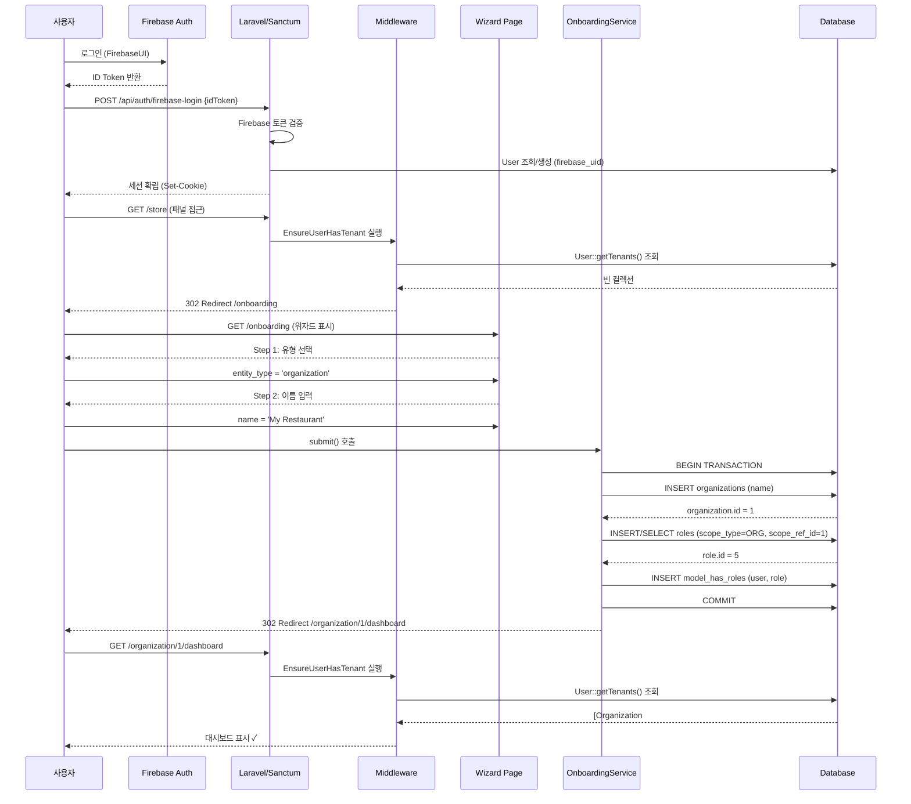
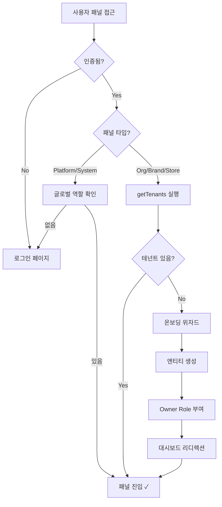
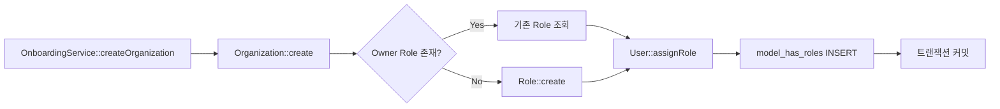
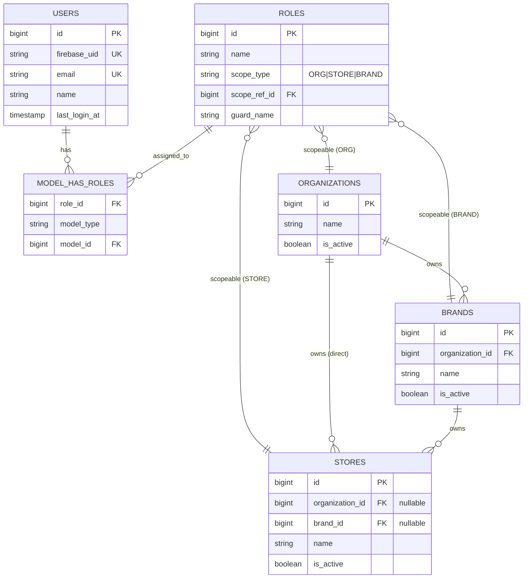
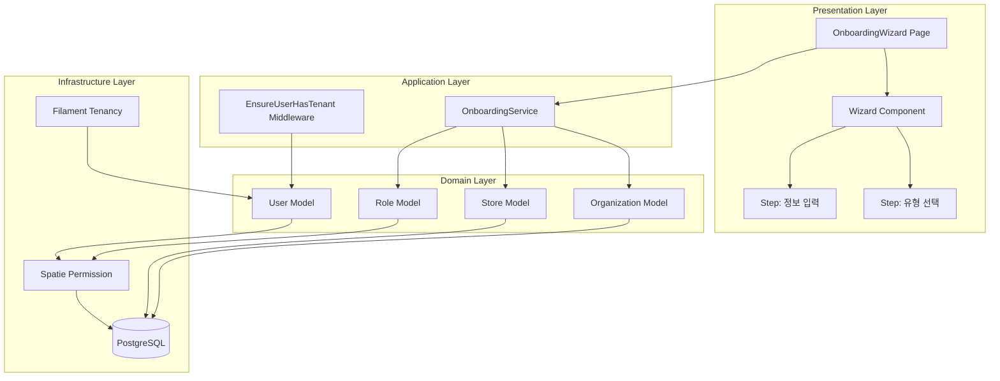
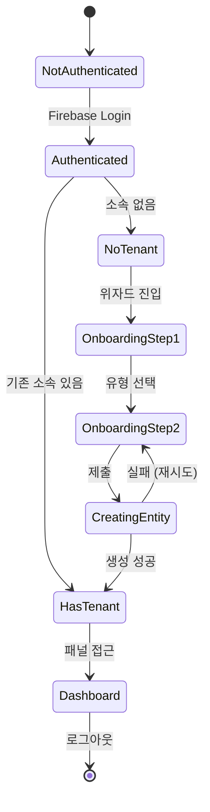

# 사용자 온보딩 플로우 아키텍처

작성일: 2025-10-19
관련 문서: `/opt/GitHub/olulo-mx-admin/docs/research/user-onboarding-wizard.md`

## 시퀀스 다이어그램

### 1. 전체 온보딩 플로우



### 2. 테넌트 확인 로직



### 3. Role 생성 및 할당



## 데이터 모델 관계도



## 컴포넌트 아키텍처



## API 엔드포인트

### 온보딩 관련 라우트

GET /onboarding
- 설명: 온보딩 위자드 페이지 표시
- 인증: 필수 (auth:web)
- 조건: 테넌트 없음
- 응답: Livewire 컴포넌트 렌더링

POST /livewire/message/onboarding-wizard
- 설명: Wizard 폼 제출 (Livewire 자동 생성)
- 인증: 필수 (auth:web)
- 바디:
  - entity_type: 'organization' | 'store'
  - name: string (max 255)
- 응답: 302 Redirect to dashboard

### 패널 진입 라우트

GET /organization/{tenant}/dashboard
- 설명: 조직 대시보드
- 인증: 필수 (auth:web)
- 미들웨어: EnsureUserHasTenant
- 조건: User가 해당 Organization의 멤버

GET /store/{tenant}/dashboard
- 설명: 매장 대시보드
- 인증: 필수 (auth:web)
- 미들웨어: EnsureUserHasTenant
- 조건: User가 해당 Store의 멤버

## 상태 전이도



## 디렉터리 구조

```
app/
├── Filament/
│   ├── Pages/
│   │   └── OnboardingWizard.php          # 위자드 페이지
│   ├── Organization/
│   │   └── Pages/
│   │       └── Dashboard.php             # 조직 대시보드
│   └── Store/
│       └── Pages/
│           └── Dashboard.php             # 매장 대시보드
├── Http/
│   ├── Controllers/
│   │   └── Auth/
│   │       └── AuthController.php        # Firebase 인증
│   └── Middleware/
│       └── EnsureUserHasTenant.php       # 테넌트 확인
├── Models/
│   ├── User.php                          # getTenants, canAccessTenant
│   ├── Organization.php                  # HasCurrentTenantLabel
│   ├── Store.php                         # HasCurrentTenantLabel
│   └── Role.php                          # scopeable MorphTo
├── Providers/
│   └── Filament/
│       ├── OrganizationPanelProvider.php
│       └── StorePanelProvider.php
└── Services/
    └── OnboardingService.php             # 엔티티 생성 로직

resources/
└── views/
    └── filament/
        └── pages/
            ├── onboarding-wizard.blade.php
            └── onboarding-submit-button.blade.php

database/
└── migrations/
    ├── 2025_10_11_053015_create_organizations_table.php
    ├── 2025_10_11_053017_create_stores_table.php
    └── 2025_09_26_152355_create_permission_tables.php

tests/
└── Feature/
    └── Onboarding/
        ├── OnboardingWizardTest.php
        ├── CreateOrganizationTest.php
        └── CreateStoreTest.php
```

## 에러 처리 시나리오

### 1. 중복 생성 시도

**상황**: 사용자가 위자드를 여러 번 제출

**해결**:
- OnboardingService::createOrganization()에서 DB 트랜잭션 사용
- 실패 시 자동 롤백
- Filament 폼 에러 메시지 표시

### 2. 네트워크 타임아웃

**상황**: 생성 중 연결 끊김

**해결**:
- DB 트랜잭션 자동 롤백
- Livewire 재시도 메커니즘
- 사용자에게 재시도 안내

### 3. 이미 테넌트 보유

**상황**: 온보딩 중 다른 창에서 초대 수락

**해결**:
- OnboardingWizard::mount()에서 재확인
- 이미 소속이 있으면 대시보드로 리디렉션
- 중복 생성 방지

### 4. 권한 불일치

**상황**: Role 부여 실패

**해결**:
- DB 트랜잭션으로 엔티티 생성도 함께 롤백
- 감사 로그(Activity Log)에 오류 기록
- 관리자에게 알림

## 성능 메트릭

### 목표 응답 시간

- 위자드 페이지 로드: < 500ms
- Step 전환: < 200ms (Livewire 인메모리)
- 엔티티 생성: < 1000ms
- 대시보드 리디렉션: < 300ms

### 데이터베이스 쿼리 최적화

1. **getTenants()**:
   - Eager Loading: `roles()->with('scopeable')`
   - 인덱스: `(scope_type, scope_ref_id)`
   - 예상 쿼리 수: 2개 (roles 조회 + scopeable 조회)

2. **createOrganization()**:
   - 쿼리 수: 3개 (INSERT org, SELECT/INSERT role, INSERT model_has_roles)
   - 트랜잭션 내 실행으로 일관성 보장

3. **canAccessTenant()**:
   - 단일 EXISTS 쿼리
   - 인덱스 활용으로 < 10ms

## 보안 체크포인트

### OWASP Top 10 대응

1. **A01:2021 – Broken Access Control**
   - EnsureUserHasTenant 미들웨어로 방지
   - canAccessTenant() 이중 확인

2. **A03:2021 – Injection**
   - Eloquent ORM 사용 (파라미터 바인딩)
   - 폼 입력 검증 (Filament 내장)

3. **A04:2021 – Insecure Design**
   - 온보딩 플로우 상태 전이 명확히 정의
   - 롤백 가능한 트랜잭션 설계

4. **A05:2021 – Security Misconfiguration**
   - CSRF 보호 (Sanctum 자동)
   - HTTPS 강제 (환경별 설정)

5. **A07:2021 – Identification and Authentication Failures**
   - Firebase Auth 2FA 지원
   - 세션 만료 정책 (config/session.php)

### 감사 로그

Spatie Activity Log 활용:

- Organization 생성: `organization.created`
- Store 생성: `store.created`
- Role 부여: `role.assigned` (커스텀 이벤트)
- 온보딩 완료: `user.onboarded` (커스텀 이벤트)

## 테스트 전략

### Unit Tests

- `OnboardingService::createOrganization()` 단위 테스트
- `OnboardingService::createStore()` 단위 테스트
- `User::getTenants()` 결과 검증
- `User::canAccessTenant()` 권한 로직 검증

### Feature Tests

- 소속 없는 사용자 패널 접근 시 온보딩 리디렉션
- 조직 생성 후 Owner Role 부여 확인
- 매장 생성 후 Owner Role 부여 확인
- 이미 소속이 있는 사용자 온보딩 건너뜀
- 위자드 폼 검증 (빈 이름, 긴 이름 등)

### Integration Tests

- Firebase Auth → Laravel 세션 → 온보딩 전체 플로우
- Livewire 컴포넌트 상호작용 테스트

### E2E Tests (Dusk)

- 브라우저에서 전체 온보딩 시나리오
- FirebaseUI 모달 상호작용
- 위자드 단계별 진행 및 뒤로가기
- 대시보드 진입 확인

## 참조

- 기술 연구 보고서: `/opt/GitHub/olulo-mx-admin/docs/research/user-onboarding-wizard.md`
- Filament Tenancy: https://filamentphp.com/docs/4.x/panels/tenancy
- Spatie Permission: https://spatie.be/docs/laravel-permission/v6
- Laravel 12 Middleware: https://laravel.com/docs/12.x/middleware
