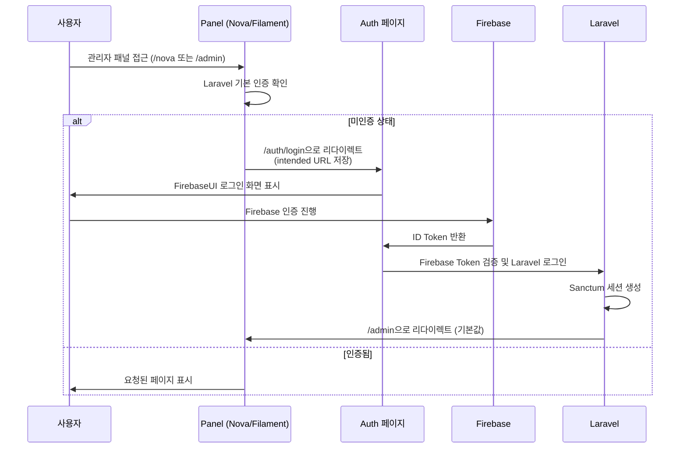
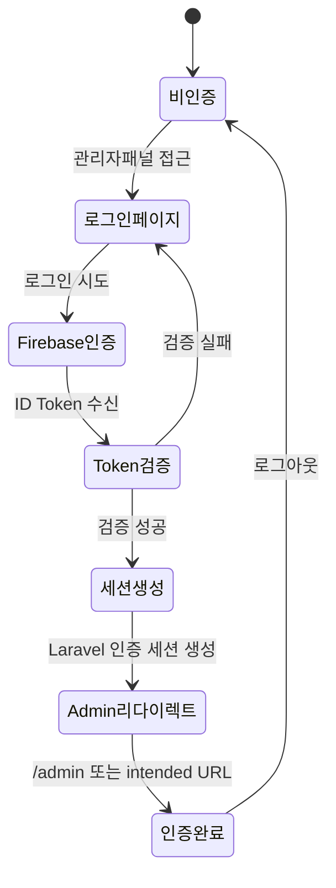

# Firebase 통합 로그인 시스템 설계 (단순화)

## 🎯 설계 목표

**하나의 Firebase UI 로그인 화면**으로 Nova와 Filament 관리자 패널에 통합 인증을 제공하고, 로그인 성공 후 `/admin`으로 리다이렉트하는 단순한 시스템 구축.

## 📐 아키텍처 개요

```
┌─────────────────────────────────────────────────────────────┐
│                    Firebase 통합 인증                        │
├─────────────────────────────────────────────────────────────┤
│  /auth/login (통합 로그인 페이지)                            │
│  ├─ FirebaseUI 로그인 화면                                   │
│  ├─ 이메일/패스워드, Google, 전화번호                        │
│  └─ 스페인어 현지화                                          │
├─────────────────────────────────────────────────────────────┤
│                   Laravel Sanctum SPA                      │
│  ├─ 기존 세션 관리 유지                                       │
│  ├─ CSRF 보호                                               │
│  └─ 기본 Laravel 인증 Guard 사용                            │
├─────────────────────────────────────────────────────────────┤
│           관리자 패널 (기본 경로로 통합)                      │
│  ├─ /nova (Nova 관리자 - 현재 설정 유지)                     │
│  └─ /admin (Filament 관리자 - 기본 리다이렉트 경로)          │
└─────────────────────────────────────────────────────────────┘
```

## 🌐 URL 구조 설계

### 경로 기반 구조 (단일 도메인)

```
기본 도메인: admin.dev.olulo.com.mx

통합 인증:
- /auth/login          ← Firebase UI 로그인 화면
- /auth/logout         ← 통합 로그아웃
- /auth/callback       ← Firebase 인증 콜백

관리자 패널:
- /nova                → Nova 대시보드 (기존 설정 유지)
- /admin               → Filament 대시보드 (기본 리다이렉트 경로)
```

### Nova/Filament 로그인 경로 오버라이드

```php
// Nova 설정 (config/nova.php 수정)
'guard' => 'web',  // 기본 Sanctum guard 사용

// Filament 설정 (AdminPanelProvider.php 수정)
->login('/auth/login')  // 로그인 경로를 /auth/login으로 오버라이드
->guard('web')          // 기본 Sanctum guard 사용
```

## 🔄 인증 플로우 설계

### 1. 단순화된 인증 시퀀스



### 2. 인증 상태 머신



## 🎨 FirebaseUI 통합 설계

### 1. 로그인 페이지 구조

```html
<!DOCTYPE html>
<html lang="es">
<head>
    <meta charset="UTF-8">
    <meta name="viewport" content="width=device-width, initial-scale=1.0">
    <title>Olulo MX - Iniciar Sesión</title>
    <link href="{{ asset('css/app.css') }}" rel="stylesheet">
    <script src="https://www.gstatic.com/firebasejs/9.x.x/firebase-app.js"></script>
    <script src="https://www.gstatic.com/firebasejs/9.x.x/firebase-auth.js"></script>
    <script src="https://www.gstatic.com/firebasejs/ui/6.x.x/firebase-ui-auth.js"></script>
    <link type="text/css" rel="stylesheet" href="https://www.gstatic.com/firebasejs/ui/6.x.x/firebase-ui-auth.css" />
</head>
<body class="bg-gradient-to-br from-orange-400 to-red-600 min-h-screen">
    <div class="container mx-auto px-4 py-8">
        <div class="max-w-md mx-auto bg-white rounded-lg shadow-xl p-8">
            <!-- Olulo 로고 -->
            <div class="text-center mb-8">
                
                <h1 class="text-2xl font-bold text-gray-800 mt-4">Panel de Administración</h1>
                <p class="text-gray-600">Acceso para administradores</p>
            </div>

            <!-- FirebaseUI 컨테이너 -->
            <div id="firebaseui-auth-container"></div>
        </div>
    </div>

    <script>
        initializeFirebaseAuth();
    </script>
</body>
</html>
```

## 🛠️ 구현 컴포넌트 목록

### 1. 백엔드 컴포넌트

```php
// app/Http/Controllers/Auth/AuthController.php
class AuthController extends Controller
{
    public function showLogin(Request $request)
    {
        // /auth/login 페이지 표시
        // intended URL을 세션에 저장
    }

    public function firebaseCallback(Request $request)
    {
        // Firebase ID Token 검증
        // Laravel 사용자 생성/업데이트
        // Sanctum 세션 생성
        // /admin 또는 intended URL로 리다이렉트
    }

    public function logout(Request $request)
    {
        // Laravel 세션 종료
        // Firebase 세션 종료
        // /auth/login으로 리다이렉트
    }
}
```

### 2. 설정 변경

**Nova 설정 변경 (config/nova.php):**
```php
'guard' => 'web',  // Sanctum guard 사용
```

**Filament 설정 변경 (AdminPanelProvider.php):**
```php
->login('/auth/login')  // 로그인 경로 오버라이드
->guard('web')          // Sanctum guard 사용
```

### 3. 라우팅

```php
// routes/web.php
Route::prefix('auth')->group(function () {
    Route::get('/login', [AuthController::class, 'showLogin'])->name('login'); // 기존 Laravel 호환
// 실제 로그인은 /auth/login 경로 사용:
    Route::post('/callback', [AuthController::class, 'firebaseCallback'])->name('auth.callback');
    Route::post('/logout', [AuthController::class, 'logout'])->name('auth.logout');
});
```

## 🔒 보안 고려사항

### 1. 기존 Laravel 보안 모델 유지
- Laravel Sanctum SPA 세션 관리
- CSRF 보호 유지
- 기존 인증 가드 활용

### 2. Firebase 토큰 검증
- 서버사이드 Firebase Admin SDK로 ID Token 검증
- 검증 후 Laravel 세션 생성
- Firebase UID를 사용자 테이블에 저장

### 3. 최소 권한 구현
- 현재는 역할 구분 없이 단순 인증만 구현
- 추후 역할 기반 접근제어 확장 가능

## 📋 구현 로드맵

### Phase 1: 기본 인증 구조 (1주)
- [ ] AuthController 생성 및 기본 라우트 구성
- [ ] Firebase UI 로그인 페이지 구현
- [ ] Nova/Filament 로그인 경로 오버라이드

### Phase 2: Firebase 통합 (1주)
- [ ] Firebase Admin SDK 통합
- [ ] ID Token 검증 로직 구현
- [ ] Laravel 사용자 생성/업데이트 로직

### Phase 3: UI/UX 완성 (1주)
- [ ] FirebaseUI 스페인어 현지화
- [ ] 멕시코 브랜드 테마 적용
- [ ] 에러 처리 및 사용자 피드백

### Phase 4: 테스트 및 최적화 (1주)
- [ ] 기본 인증 플로우 테스트
- [ ] 보안 검증
- [ ] 성능 최적화

## 🧪 테스트 시나리오

### 기본 테스트
1. **로그인 플로우**: `/admin` 접근 → `/auth/login` 리다이렉트 → Firebase 로그인 → `/admin` 복귀
2. **로그아웃 플로우**: 로그아웃 → `/auth/login` 리다이렉트
3. **세션 유지**: 로그인 후 새로고침 시 세션 유지
4. **intended URL**: `/nova` 접근 → 로그인 → `/nova` 복귀

### 보안 테스트
1. **토큰 검증**: 잘못된 Firebase ID Token 거부
2. **CSRF 보호**: CSRF 토큰 없는 요청 거부
3. **세션 타임아웃**: 세션 만료 시 재로그인

---

이 단순화된 설계는 기존 Laravel Sanctum 인증 구조를 최대한 활용하면서 Firebase UI만 통합하는 방식으로, 복잡성을 최소화하고 안전성을 극대화합니다.