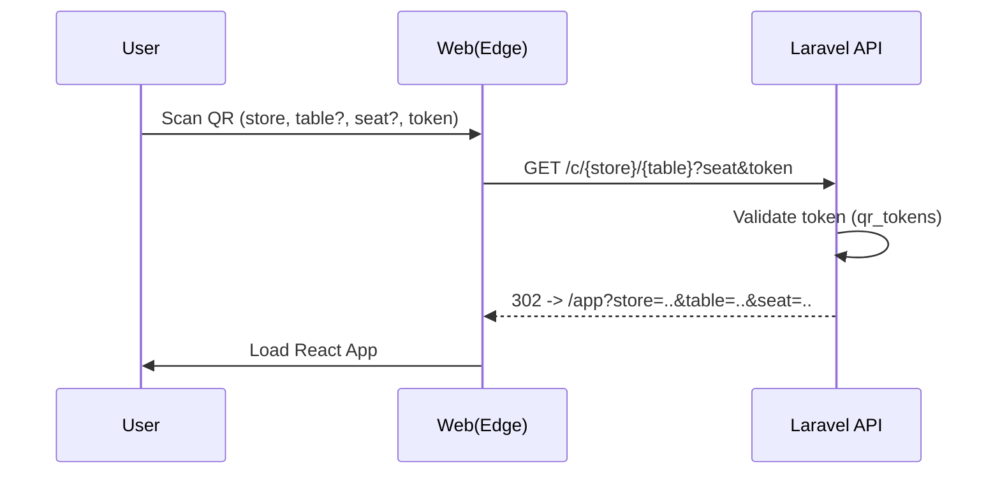
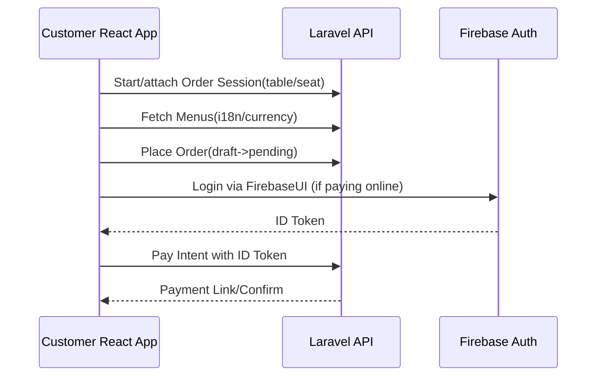

# Olulo MX Admin — Whitepaper (Laravel + Filament Admin, React Customer App)

작성일: 2025-09-24 (KST)
주요 지역: Mexico (es-MX 기본), 다국어/다중 통화 지원

## 1. 시스템 개요
- 목적: 오프라인 레스토랑의 테이블 오더/픽업/방문예약/배달예약 주문을 통합 관리하는 관리자 시스템과 고객 주문 페이지 제공.
- 관리자: Laravel 11 + Filament 기반의 Admin Console.
- 고객 페이지: React 기반 PWA. QR로 진입, 좌석/테이블/매장 기반 주문.
- 인증: FirebaseUI를 이용한 고객/매장 사용자 인증. 비회원 주문 가능하나 결제 시점 로그인 필요.
- 국제화/통화: 브라우저 언어 감지 + 수동 언어 전환. 다중 통화 및 환율 노출. 가격 노출 방식 3종(실시간 환율 API/수동 환율/메뉴별 커스텀 가격).
- 지역: 주 서비스 지역은 멕시코. WhatsApp 알림, PoS 연동 지원.

## 2. 목표 및 범위
- 목표
  - QR 진입 → 인증 토큰 검증 → 고객 페이지 자동 진입 플로우 확립
  - 매장/테이블/좌석 기반 주문 세션 관리 및 일괄 정산 지원
  - 메뉴/옵션 관리, 세트메뉴, 다국어/다중통화, 가격 전략 3종 지원
  - 실시간 알림(웹/WhatsApp)과 PoS 출력 연동
  - 리뷰/후기/포인트 시스템 지원
- 범위
  - 관리자 콘솔(매장/그룹 관리, 메뉴/옵션/세트, 주문/결제/정산/리포트)
  - 고객 웹앱(메뉴 열람, 주문/결제, 서비스콜, 리뷰, 언어/통화 선택)
  - 통합(환율 API, WhatsApp Business API, PoS, AI 이미지/번역)

## 3. 기본 가정
- QR에 포함된 URL은 매장/테이블/좌석 식별자와 인증 토큰을 포함한다.
- 인증 토큰이 유효하면 고객 페이지로 진입, 비회원 상태로도 주문 가능.
- 온라인 결제(게이트웨이)는 로그인 필요(Firebase 인증 토큰 검증).
- 메뉴 다국어는 기본 캐싱 후 요청 시점 동적 번역/저장도 지원.
- 멀티테넌시: 그룹관리 매장(프랜차이즈)과 일반 매장 분리 운영.

## 4. 전체 아키텍처
- Backend: Laravel 11, PHP 8.2+, Filament 3.x Admin, MySQL/Aurora.
- Frontend: React 18 + Vite, PWA, i18n, Tailwind + daisyUI.
- Auth: Firebase Authentication(FirebaseUI), 백엔드에서 Firebase ID Token 검증 미들웨어.
- 참고: 인증/세션 구성 상세는 `docs/auth.md` 및 환경별 설정은 `docs/devops/environments.md` 참조.
- Realtime/Notification: Laravel Events + Queues, WhatsApp Business API(또는 CPaaS, 예: Twilio), WebPush/WS(optional).
- Caching: Redis(세션/캐시), HTTP 캐시 헤더, 메뉴/환율 캐시 계층.
- Background: Horizon(Queue), Scheduler(환율 신선화, 정산/리포트, 알림 재시도 등).
- Integrations: PoS(프린터/미들웨어), 환율 API(예: OpenExchangeRates, Fixer), AI(이미지, 번역).

```mermaid
flowchart LR
  A[QR Scan] --> B[GET /c/{store}/{table}?seat&token]
  B --> C{Token Valid?}
  C -- No --> D[403/Redirect]
  C -- Yes --> E[Customer React App]
  E --> F[Menu Fetch (i18n/currency)]
  E --> G[Order Session Start]
  G --> H[Place Order]
  H --> I[Payment (Login Required)]
  I --> J[Notify: WhatsApp/PoS]
```

## 5. 멀티테넌시 및 권한 모델
- 멀티테넌시 전략
  - 테넌트: `store` 단위, 그룹형은 `store_group` 보유.
  - 데이터 스코핑: 모든 주요 엔티티에 `store_id`(또는 `store_group_id`) 적용.
  - 정책: 사용자 권한(Role/Policy) + 소유권 스코프.
- 권한/역할(예시)
  - `super_admin`: 플랫폼 전역 관리
  - `group_owner`, `group_manager`: 그룹 관리/입점 매장 관리
  - `store_owner`, `store_manager`: 매장 전반
  - `floor_manager`, `table_staff`: 홀/테이블 관리, 주문 알림 수신
  - `analyst`: 리포트 열람

## 6. 데이터 모델(핵심 스키마)
RDBMS: MySQL 8.x. 표준 칼럼: `id(BIGINT PK)`, `created_at`, `updated_at`, `deleted_at(SoftDelete)`, `uuid`, `indexes` 설계.

- store_group
  - id, name, country_code, timezone, currency_default, settings(json)
  - indices: (name), (country_code)
- stores
  - id, store_group_id FK nullable, name, code, country_code, timezone, default_locale, supported_locales(json), supported_currencies(json), settings(json)
  - indices: (store_group_id), (code unique), (country_code)
- users
  - id, firebase_uid, email, phone, name, last_login_at
  - indices: (firebase_uid unique), (email), (phone)
- roles, permissions, role_user, permission_role (표준 RBAC)
- store_user (매장-사용자 소속/권한)
  - id, store_id FK, user_id FK, role_id FK
  - indices: composite(store_id, user_id), (role_id)
- store_tables
  - id, store_id FK, code, name, capacity, area, status(enum: active/inactive)
  - indices: (store_id, code unique)
- store_table_seats
  - id, table_id FK, seat_no, label
  - indices: (table_id, seat_no)
- qr_tokens
  - id, store_id FK, table_id FK nullable, seat_id FK nullable, token(hash), expires_at, active(bool)
  - indices: (token unique), (store_id, table_id, seat_id)
- menu_categories
  - id, store_id FK, parent_id FK nullable, position, status, is_virtual(bool)
  - indices: (store_id), (parent_id), (is_virtual)
- menus
  - id, store_id FK, category_id FK nullable, code, status, is_set_menu(bool), image_url, attributes(json)
  - indices: (store_id, code), (category_id)
- menu_translations
  - id, menu_id FK, locale, name, description, keywords
  - indices: (menu_id, locale unique)
- menu_prices
  - id, menu_id FK, currency, strategy(enum: fx_api, fx_manual, custom), base_price(decimal[12,2]), fx_rate(decimal[12,6]) nullable, custom_price(decimal[12,2]) nullable, effective_at, expires_at
  - indices: (menu_id, currency, effective_at), (strategy)
- option_groups
  - id, store_id FK, name_key, min_select, max_select, allow_quantity(bool), multi_select(bool), required(bool)
  - indices: (store_id)
- option_items
  - id, option_group_id FK, code, position, status
  - indices: (option_group_id), (code)
- option_translations
  - id, option_item_id FK, locale, name
  - indices: (option_item_id, locale)
- option_item_prices
  - id, option_item_id FK, currency, delta_price(decimal[12,2])
  - indices: (option_item_id, currency)
- set_menu_items
  - id, menu_id FK(set), child_menu_id FK, option_group_id FK nullable, quantity_default, required(bool)
  - indices: (menu_id), (child_menu_id)
- orders
  - id, store_id FK, order_session_id FK nullable, order_type(enum: table, pickup, reservation, delivery), status(enum: pending, accepted, preparing, served, completed, canceled, refunded), customer_uid(Firebase UID nullable), customer_name, customer_phone, currency, subtotal, tax, discount, service_charge, total, notes
  - indices: (store_id, status), (customer_uid), (order_session_id)
- order_sessions
  - id, store_id FK, table_id FK, seat_id FK nullable, opened_by_user_id FK nullable, opened_at, closed_at, status(enum: open, settling, closed)
  - indices: (store_id, table_id, status)
- order_items
  - id, order_id FK, menu_id FK, name_snapshot, quantity, unit_price, line_total, attributes(json)
  - indices: (order_id)
- order_item_options
  - id, order_item_id FK, option_item_id FK nullable, name_snapshot, quantity, delta_price, line_total
  - indices: (order_item_id)
- payments
  - id, order_id FK, method(enum: card, cash, transfer, wallet), provider, provider_txn_id, amount, currency, status(enum: pending, paid, failed, refunded), paid_at, metadata(json)
  - indices: (order_id), (provider, provider_txn_id)
- currencies
  - code(PK), symbol, name
- exchange_rates
  - id, base_currency, quote_currency, rate(decimal[18,8]), source(enum: api, manual), effective_at
  - indices: (base_currency, quote_currency, effective_at desc)
- locale_texts (optional 캐시 테이블)
  - id, store_id FK nullable, entity_type, entity_id, locale, key, text
  - indices: (store_id, entity_type, entity_id, locale)
- notifications
  - id, store_id FK, type(enum: order_update, service_call, review, settlement), channel(enum: web, whatsapp, pos), to_user_id FK nullable, to_phone nullable, payload(json), status(enum: pending, sent, failed), sent_at
  - indices: (store_id, type, channel, status)
- service_calls
  - id, store_id FK, table_id FK, seat_id FK nullable, call_type(enum: waiter, tissue, water, custom), message, status(enum: open, ack, done), created_by_customer_uid nullable
  - indices: (store_id, table_id, status)
- reviews
  - id, store_id FK, order_id FK nullable, customer_uid nullable, target_type(enum: menu, store), target_id, rating(int 1-5), comment, photos(json), videos(json), status(enum: pending, published, hidden)
  - indices: (store_id, target_type, target_id), (rating)
- points_accounts
  - id, owner_type(enum: group, store, customer), owner_id, balance, currency
  - indices: (owner_type, owner_id)
- point_transactions
  - id, account_id FK, type(enum: earn, redeem, expire, adjust), amount, reference_type, reference_id, metadata(json)
  - indices: (account_id), (type)
- imports (Excel 업로드 이력)
  - id, store_id FK, type(enum: menu, price, option, table, user), status(enum: pending, processing, completed, failed), file_path, report(json)

참고: 모든 FK는 ON DELETE RESTRICT/SET NULL을 케이스별로 선택. 빈번 조회 컬럼에 인덱스 최적화. 주문/결제/알림 테이블은 파티셔닝 고려(대규모 트래픽 대비).

## 7. 핵심 유즈케이스 및 시퀀스
### 7.1 QR 진입 및 고객 페이지 이동


### 7.2 주문 플로우(비회원→결제 직전 로그인)


### 7.3 알림/PoS/WhatsApp
- 주문 상태 변경 이벤트 발생 → 큐 작업 → 채널별 전송(웹/WhatsApp/PoS) → 결과 저장.

## 8. API 스펙(요약)
베이스: `/api/v1`
- Public(Customer)
  - GET `/customer/bootstrap` → 설정/지원통화/언어, 환율 스냅샷
  - GET `/customer/menus` params: `store_id`, `locale`, `currency`, `category_id?`, `q?`
  - POST `/customer/session` body: `store_id`, `table_id?`, `seat_id?` → `order_session_id`
  - POST `/customer/orders` body: `order_session_id`, `items[]`, `notes?` → `order_id`
  - GET `/customer/orders/{id}`
  - POST `/customer/payments/intent` body: `order_id`, `method`, `currency` (Header: Firebase ID Token if online)
  - POST `/customer/service-calls` body: `type`, `message?`, location context
  - POST `/customer/reviews` body: `target_type`, `target_id`, `rating`, `comment`, `media[]`
  - POST `/customer/locale` body: `locale`, `/customer/currency` body: `currency`
- Admin(Filament/REST)
  - POST `/admin/imports` (Excel 업로드)
  - CRUD 메뉴/옵션/세트/카테고리, 테이블/좌석, 사용자/권한, 환율/가격, 알림 설정, 포인트 정책 등
- Webhooks/Integrations
  - POST `/webhooks/whatsapp` 상태 업데이트
  - POST `/webhooks/payment` 결제 게이트웨이 콜백
  - POST `/webhooks/pos` 프린트/수신 확인

결제 게이트웨이(멕시코): operacionesenlinea.com 사용. 자세한 단계/설정은 마일스톤 문서(프로젝트 3) 참고.

인증/인가
- Customer: Firebase ID Token(Bearer) 검증 미들웨어, 비회원은 공용 엔드포인트만 허용(결제는 토큰 필수)
- Admin: Firebase Auth + RBAC(Policy) + 멀티테넌시 스코프

## 9. 국제화(i18n) 및 다중 통화
- 언어: ko, en, es-MX 최소 3개. 브라우저 감지 + 수동 전환.
- 번역 전략
  - 메뉴/옵션: `menu_translations`, `option_translations`에 저장/캐시
  - AI 번역 API 통한 최초/요청시점 동적 번역 → 승인/수정 후 고정 저장 가능
- 통화/가격 노출
  - 우선순위: 메뉴 커스텀 가격(custom) > 환율 수동(fx_manual) > 환율 API(fx_api)
  - 환율 캐시 TTL, 가격 유효기간(effective_at/expire)로 시간적 일관성 보장

## 10. 가격/환율 전략 세부
- 실시간 환율 API: 스케줄러로 N분/시간 단위 갱신 → `exchange_rates`
- 수동 환율: 관리자 입력 → 소스=manual 우선순위 반영
- 메뉴 커스텀 가격: 통화별 `menu_prices.custom_price` 존재 시 최우선
- 계산식 예시
  - 표시가: `custom_price` || `base_price * fx_rate(rounding rules)`
  - 옵션가: `delta_price` 통화별 테이블 존재
- 라운딩 규칙: 통화별 최소 단위, 세금/서비스차지 정책(매장 설정) 적용

## 11. 주문/세션/정산
- 주문 세션(`order_sessions`): 테이블 단위 Open → 여러 주문 묶음 → Settling → Closed
- 정산: 결제완료 주문 합산, 현금/카드 혼합 처리 지원(멀티 페이먼트)
- 취소/환불: 상태 전이 규칙 정의 및 감사 로그

## 12. 리뷰/후기/서비스콜
- 리뷰: 메뉴/매장 대상, 사진/영상/별점, 승인 워크플로우(optional)
- 서비스콜: 웨이터 호출/물/물티슈 등 커스텀, 실시간 알림 + 처리 상태 추적

## 13. 알림 및 WhatsApp
- WhatsApp Business API 또는 CPaaS(Twilio) 연동. 템플릿 메시지 승인 필요.
- 트리거: 주문 접수/상태 변경/서빙/완료, 서비스콜, 리뷰 요청 등
- 담당자 라우팅: 테이블 담당자에게 우선 전송, 실패 시 대체 채널

## 14. PoS 연동
- 방식: 로컬 프린터 게이트웨이, 또는 PoS 미들웨어 HTTP API
- 출력: 주문서/주방지시서(KDS), 수신 확인/재시도 로직

## 15. 파일/미디어 및 AI
- 이미지 저장: Object Storage(S3 호환). 서명 URL 사용.
- AI 이미지 생성: 메뉴 초안 자동 생성(승인 플로우)
- AI 번역: 초안 번역 생성 후 운영자 승인/수정 반영

## 16. 성능/캐싱/보안/컴플라이언스
- 캐싱: 메뉴/카테고리/환율/설정 Redis 캐시. Stale-while-revalidate 패턴.
- N+1 방지, 인덱스 정비, 대용량 테이블 파티셔닝~아카이빙 정책.
- 보안: Firebase 토큰 검증, CSRF 보호(Admin), 입력 검증(Form Request), XSS/SQLi 방지, 속도 제한(rate limit).
- 개인정보/규제: 멕시코 개인정보 보호법 준수, 결제정보 토큰화, PII 최소화.

## 17. 운영(배포/모니터링)
- CI/CD: GitHub Actions, Laravel Vapor/Forge/EC2 등. .env 분리.
- 모니터링: Laravel Telescope, OpenTelemetry, Error Tracking(Sentry), Uptime.
- 큐/Horizon 대시보드, 스케줄러 헬스체크.

관련 문서
- 인증 설계: `docs/auth.md`
- 환경별 도메인/CORS: `docs/devops/environments.md`
- 프로젝트 1 상세: `docs/milestones/project-1.md`

## 18. React 고객 앱 설계(요약)
- 라우팅: `/app?store&table&seat` 진입. Onboarding → Session attach → Menu → Cart → Order → Payment
- 상태관리: React Query + Zustand/Redux. i18n: react-i18next.
- 모듈: MenuList/Search, MenuDetail(옵션/세트 구성), Cart, OrderStatus, Payment, ServiceCall, Reviews, Language/Currency Switcher
- PWA: 오프라인 캐시(메뉴/설정 스냅샷), 네트워크 복구 전략

## 19. Filament Admin 설계(요약)
- 리소스: Store/Group, Table/Seat, Menu/Category/Option/Set, Orders/Payments/Sessions, Users/Roles, Currencies/FX, Notifications, Imports, Reviews, Points
- 대시보드: 실시간 주문 현황, 테이블 뷰, 알림 큐 상태, 매출/메뉴 Top
- Excel Import: 유효성 검증, 시뮬레이션, 롤백 리포트

## 20. 로드맵/마일스톤
- M1: QR→세션→메뉴 표시→주문 생성(비회원) + Admin 기초 리소스
- M2: 결제 게이트웨이 + Firebase 로그인, WhatsApp/PoS 알림, 환율/통화
- M3: 리뷰/포인트/AI 이미지/AI 번역, 리포트 고도화
- M4: 성능/캐시/다국어 고도화, 다지점 그룹 운영 기능 강화

마일스톤 상세 문서는 별도 폴더에 정리되어 있습니다:
- 인덱스: [docs/milestones/README.md](./milestones/README.md)
- 프로젝트 1: [docs/milestones/project-1.md](./milestones/project-1.md)
- 프로젝트 2: [docs/milestones/project-2.md](./milestones/project-2.md)
- 프로젝트 3: [docs/milestones/project-3.md](./milestones/project-3.md)
- 프로젝트 4: [docs/milestones/project-4.md](./milestones/project-4.md)

## 21. 비기능 요구사항(NFR)
- 가용성: 99.9% 이상. 장애시 대체 알림 경로.
- 성능: P95 응답 300ms 이하(캐시 히트 시), 대용량 메뉴 10k 스케일 처리.
- 보안: OWASP Top10 대응, 비밀관리(Param Store/Secrets Manager), 감사로그.
- 확장성: 멀티 리전 확장 가능 아키텍처.
- 관측성: 분산 트레이싱/로그/메트릭 일관 수집.
